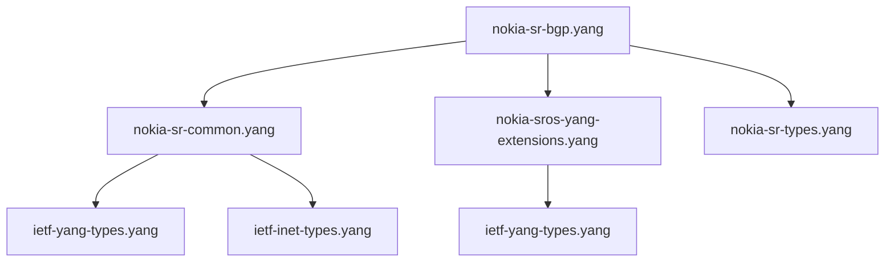

# Nokia Models

Comprehensive documentation for Nokia SROS YANG models in the workspace.

## Overview

Nokia SROS (Service Router Operating System) provides YANG models for network configuration and management. This workspace includes the core BGP-related models and their dependencies.

**Source Repository:** [Nokia 7x50 YANG Models](https://github.com/nokia/7x50-YangModels)  
**Local Path:** `yang-models-nokia/`  
**Symlink Location:** `models/nokia/`

## Available Models

### Core BGP Models

#### `nokia-sr-bgp.yang`
**Description:** Main BGP configuration model for Nokia SROS  
**Location:** `models/nokia/nokia-sr-bgp.yang`  
**Status:** ✅ Validated

**Key Features:**
- BGP global configuration
- Neighbor configuration and policies
- Route filtering and redistribution
- BGP communities and extended communities
- Multi-protocol BGP support (IPv4, IPv6, VPN)

**Structure:**
```
module: nokia-sr-bgp
  +--rw configure
     +--rw router* [router-name]
        +--rw bgp
           +--rw admin-state?            nokia-types:admin-state
           +--rw router-id?              inet:ipv4-address
           +--rw cluster-id?             inet:ipv4-address
           +--rw confederation?          uint32
           +--rw local-as?               uint32
           +--rw neighbor* [ip-address]
           |  +--rw ip-address           inet:ip-address
           |  +--rw admin-state?         nokia-types:admin-state
           |  +--rw peer-as?             uint32
           |  +--rw local-as?            uint32
           |  +--rw authentication-key? nokia-types:encrypted-leaf
           +--rw group* [group-name]
           +--rw policy-options
           +--rw route-reflector
```

#### `nokia-sr-common.yang`
**Description:** Common types and definitions used across Nokia models  
**Location:** `models/nokia/nokia-sr-common.yang`  
**Status:** ✅ Validated

**Provides:**
- Common data types (`nokia-types`)
- Shared configuration patterns
- Administrative state definitions
- Interface references

### Extension Models

#### `nokia-sros-yang-extensions.yang`
**Description:** Nokia-specific YANG extensions  
**Location:** `models/nokia/nokia-sros-yang-extensions.yang`  
**Status:** ✅ Validated

**Extensions:**
- `nokia-sros-yang-extensions:oper-flag` - Operational state indicators
- `nokia-sros-yang-extensions:immutable` - Configuration immutability
- `nokia-sros-yang-extensions:auto-restart` - Service restart behavior

#### `nokia-sr-types.yang`
**Description:** Nokia-specific data types and identities  
**Location:** `models/nokia/nokia-sr-types.yang`  
**Status:** ✅ Validated

**Defines:**
- Administrative states
- Interface types  
- Protocol identities
- Custom data types for Nokia equipment

## Model Dependencies

### Dependency Graph



### Required Dependencies

To use Nokia BGP models, ensure these dependencies are available:

**IETF Standards:**
- `ietf-yang-types.yang` - Standard YANG types
- `ietf-inet-types.yang` - Internet address types

**Nokia Specific:**
- `nokia-sr-common.yang` - Common definitions
- `nokia-sros-yang-extensions.yang` - Nokia extensions
- `nokia-sr-types.yang` - Nokia-specific types

## Validation Examples

### Basic Validation

```bash
# Validate Nokia BGP model
./validate-nokia-bgp.sh

# Output:
# Validating Nokia BGP models...
# ✓ nokia-sr-bgp.yang: Valid
# ✓ nokia-sr-common.yang: Valid
# ✓ nokia-sros-yang-extensions.yang: Valid
# Summary: 3 models validated, 0 errors
```

### Tree Structure Generation

```bash
# Generate tree for Nokia BGP
./validate-nokia-bgp.sh -t

# Or using pyang directly
pyang --format=tree --path=models/nokia:models/ietf models/nokia/nokia-sr-bgp.yang
```

### Dependency Checking

```bash
# Check dependencies
./validate-nokia-bgp.sh -d

# Manual dependency check
pyang --print-error-code --path=models/nokia:models/ietf models/nokia/nokia-sr-bgp.yang
```

## Configuration Examples

### Basic BGP Configuration

```yang
configure {
    router "Base" {
        bgp {
            admin-state enable;
            router-id 192.168.1.1;
            local-as 65001;
            
            neighbor "192.168.1.2" {
                admin-state enable;
                peer-as 65002;
                authentication-key "secret123";
            }
        }
    }
}
```

### Route Reflector Setup

```yang
configure {
    router "Base" {
        bgp {
            cluster-id 1.1.1.1;
            route-reflector {
                client "192.168.1.10";
                client "192.168.1.11";
            }
        }
    }
}
```

### BGP Communities

```yang
configure {
    router "Base" {
        bgp {
            policy-options {
                community "LOCAL_PREF_HIGH" {
                    member "65001:100";
                }
            }
        }
    }
}
```

## Nokia-Specific Features

### Administrative States

Nokia models use specific administrative state values:
- `enable` - Service is operational
- `disable` - Service is shut down
- `maintenance` - Service is in maintenance mode

### Immutable Configuration

Some Nokia configuration elements are immutable (cannot be changed without service restart):
```yang
// Example: Local AS cannot be changed online
local-as 65001; // Immutable after commit
```

### Auto-Restart Services

Nokia extensions indicate when configuration changes trigger automatic service restarts:
```yang
// BGP neighbor changes may auto-restart sessions
neighbor "192.168.1.2" {
    peer-as 65002; // May trigger session restart
}
```

## Version Compatibility

### Supported SROS Versions

The Nokia models in this workspace are compatible with:
- **SROS 20.x** - Full compatibility
- **SROS 21.x** - Full compatibility  
- **SROS 22.x** - Full compatibility
- **SROS 23.x** - Full compatibility (latest)

### Model Versioning

Nokia models include version information:
```yang
revision "2023-07-01" {
    description "SROS 23.7.R1 release";
}
```

## Common Issues

### Extension Resolution

**Issue:** Extension not found
```
error: extension "nokia-sros-yang-extensions:immutable" not found
```

**Solution:** Ensure extension model is in YANG path
```bash
pyang --path=models/nokia:models/ietf models/nokia/nokia-sr-bgp.yang
```

### Import Errors

**Issue:** Module import failure
```
error: module "nokia-sr-common" not found in models/nokia/nokia-sr-bgp.yang
```

**Solution:** Verify symlinks and dependencies
```bash
./scripts/setup-bgp-models.sh  # Recreate symlinks
ls -la models/nokia/   # Check symlink integrity
```

### Circular Dependencies

**Issue:** Circular import detected
```
error: circular dependency between modules
```

**Solution:** Review import order, may need to split models

## Advanced Usage

### Custom Validation Rules

Create Nokia-specific validation rules:
```bash
#!/bin/bash
# validate-nokia-custom.sh

# Check for Nokia-specific patterns
grep -r "nokia-sros-yang-extensions:" models/nokia/ || echo "No extensions found"

# Validate against specific SROS version
pyang --sros-version=23.7 models/nokia/nokia-sr-bgp.yang
```

### Configuration Generation

Generate sample configurations:
```bash
# Generate sample config from model
pyang --format=sample-xml-skeleton models/nokia/nokia-sr-bgp.yang > nokia-bgp-sample.xml
```

### Documentation Generation

Create HTML documentation:
```bash
pyang --format=jstree models/nokia/nokia-sr-bgp.yang > nokia-bgp-doc.html
```

## Related Documentation

- [Models Overview](../user-guide/models-overview.md) - All available models
- [OpenConfig Models](openconfig.md) - OpenConfig alternatives
- [Validation Workflows](../user-guide/validation.md) - Testing procedures
- [Scripts Reference](../user-guide/scripts-reference.md) - Nokia validation scripts

## External Resources

- [Nokia YANG Model Repository](https://github.com/nokia/7x50-YangModels)
- [Nokia SROS Documentation](https://documentation.nokia.com/sr/)
- [YANG RFC 7950](https://tools.ietf.org/html/rfc7950)
- [Nokia SR OS YANG Guide](https://documentation.nokia.com/sr/)
