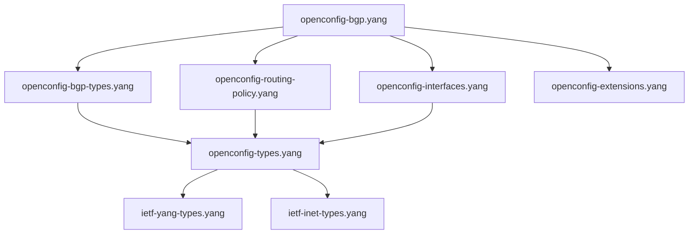

# OpenConfig Models

Comprehensive documentation for OpenConfig YANG models in the workspace.

## Overview

OpenConfig is an industry initiative to develop vendor-neutral, standards-based network configuration and telemetry models. The workspace includes BGP-related OpenConfig models and their dependencies.

**Source Repository:** [OpenConfig Public YANG Models](https://github.com/openconfig/public)  
**Local Path:** `yang-models-openconfig/`  
**Symlink Location:** `models/openconfig/`

## Available Models

### Core BGP Models

#### `openconfig-bgp.yang`
**Description:** Main BGP configuration model following OpenConfig standards  
**Location:** `models/openconfig/openconfig-bgp.yang`  
**Status:** ✅ Validated

**Key Features:**
- Vendor-neutral BGP configuration
- Comprehensive neighbor management
- Policy framework integration
- Operational state modeling
- Multi-protocol support (IPv4, IPv6, L3VPN, EVPN)

**Structure:**
```
module: openconfig-bgp
  +--rw bgp
     +--rw global
     |  +--rw config
     |  |  +--rw as           inet:as-number
     |  |  +--rw router-id?   yang:dotted-quad
     |  +--ro state
     |     +--ro as           inet:as-number
     |     +--ro router-id?   yang:dotted-quad
     +--rw neighbors
     |  +--rw neighbor* [neighbor-address]
     |     +--rw neighbor-address    inet:ip-address
     |     +--rw config
     |     +--ro state
     |     +--rw afi-safis
     +--rw peer-groups
     +--rw rib
```

#### `openconfig-bgp-types.yang`
**Description:** BGP-specific types and identities for OpenConfig  
**Location:** `models/openconfig/openconfig-bgp-types.yang`  
**Status:** ✅ Validated

**Provides:**
- BGP-specific identities (AFI/SAFI, BGP capabilities)
- Enumeration types (session state, origin types)
- BGP community types
- Path attribute definitions

### Supporting Models

#### `openconfig-routing-policy.yang`
**Description:** Routing policy framework used by BGP  
**Location:** `models/openconfig/openconfig-routing-policy.yang`  
**Status:** ✅ Validated

**Features:**
- Policy definitions and statements
- Match conditions and actions
- Community manipulation
- Route filtering and modification

#### `openconfig-interfaces.yang`
**Description:** Interface configuration model  
**Location:** `models/openconfig/openconfig-interfaces.yang`  
**Status:** ✅ Validated

**Features:**
- Physical and logical interface configuration
- Interface state monitoring
- Subinterface management

### Type Libraries

#### `openconfig-types.yang`
**Description:** Common OpenConfig types and extensions  
**Location:** `models/openconfig/openconfig-types.yang`  
**Status:** ✅ Validated

#### `openconfig-extensions.yang`
**Description:** OpenConfig-specific YANG extensions  
**Location:** `models/openconfig/openconfig-extensions.yang`  
**Status:** ✅ Validated

**Extensions:**
- `openconfig-version` - Model versioning
- `operational` - Operational state annotation
- `telemetry-on-change` - Streaming telemetry hints

## Model Dependencies

### Dependency Graph



### Required Dependencies

**IETF Standards:**
- `ietf-yang-types.yang` - Standard YANG types
- `ietf-inet-types.yang` - Internet address types

**OpenConfig Foundation:**
- `openconfig-types.yang` - Common OpenConfig types
- `openconfig-extensions.yang` - OpenConfig extensions

**BGP-Specific:**
- `openconfig-bgp-types.yang` - BGP identities and types
- `openconfig-routing-policy.yang` - Policy framework

## Validation Examples

### Basic Validation

```bash
# Validate OpenConfig BGP models
./validate-openconfig-bgp.sh

# Output:
# Validating OpenConfig BGP models...
# ✓ openconfig-bgp.yang: Valid
# ✓ openconfig-bgp-types.yang: Valid  
# ✓ openconfig-routing-policy.yang: Valid
# Summary: 3 models validated, 0 errors
```

### Tree Structure Generation

```bash
# Generate tree for OpenConfig BGP
./validate-openconfig-bgp.sh -t

# Or using pyang directly
pyang --format=tree --path=models/openconfig:models/ietf models/openconfig/openconfig-bgp.yang
```

### Standards Compliance Check

```bash
# Check IETF standards compliance
./validate-openconfig-bgp.sh -s

# Manual compliance check
pyang --ietf --path=models/openconfig:models/ietf models/openconfig/openconfig-bgp.yang
```

## Configuration Examples

### Basic BGP Configuration

```yang
{
  "openconfig-bgp:bgp": {
    "global": {
      "config": {
        "as": 65001,
        "router-id": "192.168.1.1"
      }
    },
    "neighbors": {
      "neighbor": [
        {
          "neighbor-address": "192.168.1.2",
          "config": {
            "neighbor-address": "192.168.1.2",
            "peer-as": 65002,
            "enabled": true
          }
        }
      ]
    }
  }
}
```

### BGP with Policy

```yang
{
  "openconfig-bgp:bgp": {
    "neighbors": {
      "neighbor": [
        {
          "neighbor-address": "192.168.1.2",
          "config": {
            "neighbor-address": "192.168.1.2",
            "peer-as": 65002
          },
          "apply-policy": {
            "config": {
              "import-policy": ["IMPORT_POLICY"],
              "export-policy": ["EXPORT_POLICY"]
            }
          }
        }
      ]
    }
  }
}
```

### Multi-Protocol BGP

```yang
{
  "openconfig-bgp:bgp": {
    "neighbors": {
      "neighbor": [
        {
          "neighbor-address": "192.168.1.2",
          "afi-safis": {
            "afi-safi": [
              {
                "afi-safi-name": "openconfig-bgp-types:IPV4_UNICAST",
                "config": {
                  "afi-safi-name": "openconfig-bgp-types:IPV4_UNICAST",
                  "enabled": true
                }
              },
              {
                "afi-safi-name": "openconfig-bgp-types:IPV6_UNICAST", 
                "config": {
                  "afi-safi-name": "openconfig-bgp-types:IPV6_UNICAST",
                  "enabled": true
                }
              }
            ]
          }
        }
      ]
    }
  }
}
```

## OpenConfig Design Principles

### Configuration and State Separation

OpenConfig models separate configuration and operational state:
- **`config`** containers - Configuration parameters
- **`state`** containers - Operational state (includes config + status)

```yang
container neighbor {
  container config {
    leaf peer-as { type uint32; }
  }
  container state {
    config false;
    leaf peer-as { type uint32; }  // Mirrors config
    leaf session-state { type enumeration; }  // Operational only
  }
}
```

### Semantic Versioning

OpenConfig models use semantic versioning:
```yang
import openconfig-extensions { prefix oc-ext; }

oc-ext:openconfig-version "3.1.1";

revision 2023-06-01 {
  description "OpenConfig BGP model version 3.1.1";
}
```

### Vendor Neutrality

Models avoid vendor-specific constructs:
- Use standard identities instead of vendor enumerations
- Provide extension points for vendor augmentations
- Focus on operational intent rather than implementation

## AFI/SAFI Support

### Supported Address Families

OpenConfig BGP supports these address families:

| AFI/SAFI | Identity | Description |
|----------|----------|-------------|
| IPv4 Unicast | `IPV4_UNICAST` | Standard IPv4 routing |
| IPv6 Unicast | `IPV6_UNICAST` | Standard IPv6 routing |
| IPv4 L3VPN | `L3VPN_IPV4_UNICAST` | MPLS L3VPN IPv4 |
| IPv6 L3VPN | `L3VPN_IPV6_UNICAST` | MPLS L3VPN IPv6 |
| EVPN | `L2VPN_EVPN` | Ethernet VPN |
| IPv4 Labeled | `IPV4_LABELED_UNICAST` | RFC 3107 labeled IPv4 |

### Configuration Example

```yang
"afi-safis": {
  "afi-safi": [
    {
      "afi-safi-name": "openconfig-bgp-types:IPV4_UNICAST",
      "config": {
        "enabled": true
      },
      "ipv4-unicast": {
        "config": {
          "send-default-route": true
        }
      }
    }
  ]
}
```

## Policy Integration

### Route Policy Framework

OpenConfig BGP integrates with the routing policy model:

```yang
"apply-policy": {
  "config": {
    "import-policy": ["ALLOW_ALL"],
    "export-policy": ["DENY_DEFAULT", "SET_COMMUNITIES"],
    "default-import-policy": "REJECT_ROUTE",
    "default-export-policy": "REJECT_ROUTE"
  }
}
```

### Community Handling

```yang
// In routing policy model
"set-community": {
  "config": {
    "method": "REPLACE",
    "communities": ["65001:100", "65001:200"]
  }
}
```

## Operational State

### Session State Monitoring

```yang
"state": {
  "session-state": "ESTABLISHED",
  "supported-capabilities": [
    "openconfig-bgp-types:MPBGP", 
    "openconfig-bgp-types:ROUTE_REFRESH"
  ],
  "messages": {
    "sent": {
      "UPDATE": 150,
      "NOTIFICATION": 0
    },
    "received": {
      "UPDATE": 89,
      "NOTIFICATION": 0
    }
  }
}
```

### Route Information Base

```yang
"rib": {
  "afi-safis": {
    "afi-safi": [
      {
        "afi-safi-name": "openconfig-bgp-types:IPV4_UNICAST",
        "ipv4-unicast": {
          "loc-rib": {
            "routes": {
              "route": [
                {
                  "prefix": "10.0.0.0/24",
                  "origin": "IGP",
                  "path-id": 0
                }
              ]
            }
          }
        }
      }
    ]
  }
}
```

## Vendor Augmentations

### Platform-Specific Extensions

Vendors can augment OpenConfig models:
```yang
// Example vendor augmentation
augment "/oc-bgp:bgp/oc-bgp:neighbors/oc-bgp:neighbor/oc-bgp:config" {
  leaf vendor-specific-parameter {
    type string;
    description "Vendor-specific BGP parameter";
  }
}
```

### Nokia Integration

Nokia SROS can map OpenConfig to native configuration:
```bash
# Convert OpenConfig to Nokia format
openconfig-to-nokia-converter bgp-config.json
```

### Common Vendor Extensions

- **Cisco:** Additional route-policy actions
- **Juniper:** Enhanced operational state
- **Arista:** Platform-specific optimizations
- **Nokia:** SROS-specific features

## Version Compatibility

### Model Versions

| Version | Release Date | Key Changes |
|---------|--------------|-------------|
| 3.1.1 | 2023-06-01 | Bug fixes, clarifications |
| 3.1.0 | 2023-03-01 | EVPN enhancements |
| 3.0.0 | 2022-12-01 | Major restructuring |
| 2.1.1 | 2022-06-01 | Policy integration fixes |

### Backward Compatibility

OpenConfig maintains backward compatibility within major versions:
- **Minor updates** (3.1.0 → 3.1.1) - Fully backward compatible
- **Major updates** (2.x → 3.x) - May require configuration migration

## Common Issues

### Import Resolution

**Issue:** Cannot find OpenConfig modules
```
error: module "openconfig-bgp-types" not found
```

**Solution:** Ensure complete OpenConfig model set
```bash
./scripts/setup-bgp-models.sh  # Recreate all symlinks
ls -la models/openconfig/  # Verify all dependencies
```

### Policy References

**Issue:** Policy not found
```
error: leafref "apply-policy/config/import-policy" points to non-existent node
```

**Solution:** Ensure routing policy model is available
```bash
pyang --path=models/openconfig:models/ietf models/openconfig/openconfig-routing-policy.yang
```

### Extension Warnings

**Issue:** Unknown extension warnings
```
warning: extension "openconfig-version" not found
```

**Solution:** Include extension model in validation
```bash
pyang --path=models/openconfig:models/ietf models/openconfig/openconfig-extensions.yang
```

## Advanced Usage

### RESTCONF API Generation

Generate RESTCONF APIs from OpenConfig models:
```bash
pyang --format=openapi models/openconfig/openconfig-bgp.yang > bgp-api.yaml
```

### Configuration Validation

Validate configuration instances:
```bash
# Validate JSON config against model
yanglint -s models/openconfig/openconfig-bgp.yang bgp-config.json
```

### Telemetry Path Generation

Generate telemetry subscription paths:
```bash
# Extract all state paths
pyang --format=xpath --xpath-state models/openconfig/openconfig-bgp.yang
```

## Related Documentation

- [Models Overview](../user-guide/models-overview.md) - All available models
- [Nokia Models](nokia.md) - Vendor-specific alternatives
- [Validation Workflows](../user-guide/validation.md) - Testing procedures
- [Scripts Reference](../user-guide/scripts-reference.md) - OpenConfig validation scripts

## External Resources

- [OpenConfig Official Website](http://openconfig.net/)
- [OpenConfig GitHub Repository](https://github.com/openconfig/public)
- [OpenConfig Documentation](https://openconfig.net/docs/)
- [YANG RFC 7950](https://tools.ietf.org/html/rfc7950)
- [OpenConfig Operator Working Group](https://github.com/openconfig/public/wiki)
