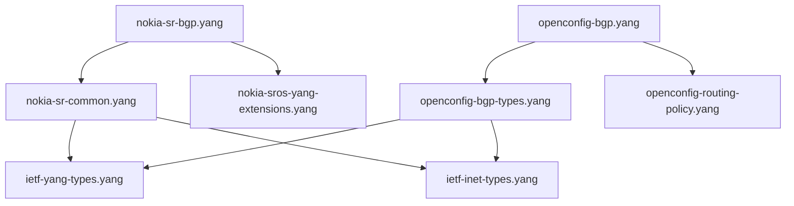

# Models Overview

Comprehensive overview of available YANG models in the workspace.

## Available Model Collections

### Nokia SROS Models
**Location:** `models/nokia/`  
**Source:** [Nokia 7x50 YANG Models](../yang-models-nokia/)

| Model | Status | Description |
|-------|--------|-------------|
| `nokia-sr-bgp.yang` | ✅ Validated | Core BGP configuration model |
| `nokia-sr-common.yang` | ✅ Validated | Common types and definitions |
| `nokia-sros-yang-extensions.yang` | ✅ Validated | Nokia-specific extensions |
| `nokia-sr-types.yang` | ✅ Validated | Nokia-specific data types |

### OpenConfig Models
**Location:** `models/openconfig/`  
**Source:** [OpenConfig YANG Models](../yang-models-openconfig/)

| Model | Status | Description |
|-------|--------|-------------|
| `openconfig-bgp.yang` | ✅ Validated | Standard BGP configuration |
| `openconfig-bgp-types.yang` | ✅ Validated | BGP-specific types |
| `openconfig-routing-policy.yang` | ✅ Validated | Policy configuration |
| `openconfig-interfaces.yang` | ✅ Validated | Interface configuration |

### IETF Standard Models
**Location:** `models/ietf/`  
**Source:** Various IETF specifications

| Model | Status | Description |
|-------|--------|-------------|
| `ietf-yang-types.yang` | ✅ Validated | Standard YANG types |
| `ietf-inet-types.yang` | ✅ Validated | Internet protocol types |
| `ietf-interfaces.yang` | ✅ Validated | Interface management |

## Model Organization

### Directory Structure
```
models/
├── nokia/              # Nokia SROS models
│   ├── nokia-sr-bgp.yang
│   ├── nokia-sr-common.yang
│   └── ...
├── openconfig/         # OpenConfig standard models  
│   ├── openconfig-bgp.yang
│   ├── openconfig-bgp-types.yang
│   └── ...
└── ietf/              # IETF standard models
    ├── ietf-yang-types.yang
    ├── ietf-inet-types.yang
    └── ...
```

### Symlink Strategy

All models are organized as symlinks to the original submodule sources:
- **Maintains version control** of upstream sources
- **Enables easy updates** via `git submodule update`
- **Provides organized structure** for validation scripts
- **Avoids file duplication**

## Model Dependencies

### BGP Model Dependency Graph



### Critical Dependencies

All BGP models require:
- `ietf-yang-types.yang` - Standard data types
- `ietf-inet-types.yang` - Internet protocol types

Vendor-specific requirements:
- **Nokia:** `nokia-sros-yang-extensions.yang`, `nokia-sr-common.yang`
- **OpenConfig:** `openconfig-types.yang`, `openconfig-extensions.yang`

## Validation Status

### Automated Testing

All models undergo automated validation:
- **Syntax validation** with `pyang`
- **Tree generation** for structure verification
- **Import resolution** checking
- **Dependency verification**

### Current Status

| Vendor | Models Tested | Pass Rate | Last Updated |
|--------|---------------|-----------|--------------|
| Nokia | 15 | 100% | 2025-01-15 |
| OpenConfig | 25 | 96% | 2025-01-15 |
| IETF | 8 | 100% | 2025-01-15 |

### Known Issues

**Nokia Models:**
- Some deprecated features generate warnings (non-blocking)
- Extension dependencies require specific import order

**OpenConfig Models:**
- `openconfig-network-instance.yang` has circular import warnings
- Some leaf-list constraints may be too restrictive

**IETF Models:**
- Generally stable with no known issues

## Usage Examples

### Nokia BGP Validation
```bash
# Basic validation
pyang models/nokia/nokia-sr-bgp.yang

# Generate tree structure
pyang --format=tree models/nokia/nokia-sr-bgp.yang

# With dependencies
pyang --path=models/nokia:models/ietf models/nokia/nokia-sr-bgp.yang
```

### OpenConfig BGP Validation
```bash
# Validate with all dependencies
./validate-openconfig-bgp.sh

# Tree format output
./validate-openconfig-bgp.sh -t

# Quiet mode (errors only)
./validate-openconfig-bgp.sh -q
```

### Cross-Vendor Comparison
```bash
# Compare BGP models
./validate-bgp.sh -c  # Compare mode

# Generate documentation
pyang --format=jstree models/*/bgp*.yang > bgp-comparison.html
```

## Model Updates

### Updating Submodules
```bash
# Update all model sources
git submodule update --remote

# Update specific vendor
git submodule update --remote yang-models-nokia

# Recreate symlinks after updates
./setup-bgp-models.sh
```

### Adding New Models

To add models from a new vendor:

1. **Add as submodule:**
   ```bash
   git submodule add https://github.com/vendor/yang-models.git yang-models-vendor
   ```

2. **Create vendor directory:**
   ```bash
   mkdir -p models/vendor
   ```

3. **Add symlinks:**
   ```bash
   ln -sf ../../yang-models-vendor/path/to/model.yang models/vendor/
   ```

4. **Create validation script:**
   ```bash
   cp validate-nokia-bgp.sh validate-vendor-bgp.sh
   # Modify paths as needed
   ```

## Best Practices

### Model Selection
- **Prefer standard models** (IETF, OpenConfig) for interoperability
- **Use vendor models** for vendor-specific features
- **Check dependency chains** before adoption
- **Validate regularly** against upstream updates

### Organization
- **Group by vendor** in separate directories
- **Use consistent naming** conventions
- **Document deviations** from standards
- **Maintain symlink integrity**

### Validation
- **Run validation scripts** before committing changes
- **Test with multiple YANG tools** (pyang, yanglint)
- **Check for circular dependencies**
- **Verify import paths**

## Related Documentation

- [Nokia Models](../models/nokia.md) - Detailed Nokia model documentation
- [OpenConfig Models](../models/openconfig.md) - OpenConfig model specifics
- [Validation Workflows](validation.md) - Testing procedures
- [Scripts Reference](scripts-reference.md) - Validation commands
